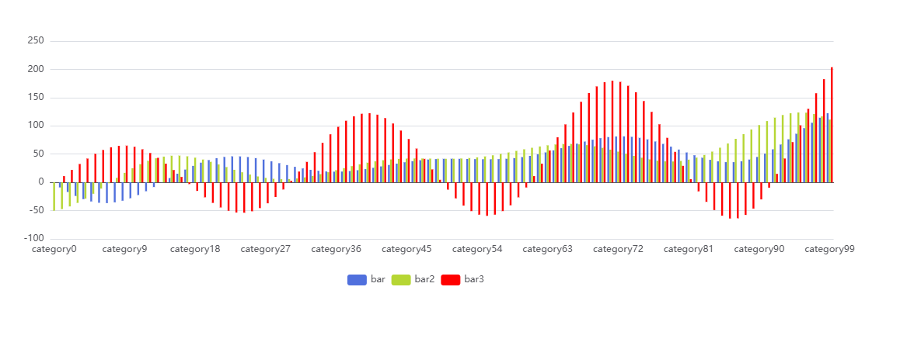

# Charts Helper Functions

The Charts Helper Functions provide methods for generating and exporting various ECharts visualizations directly from
your scripts. These visualizations can then be previewed in the ScriptBee UI.

## Overview

All chart helper functions follow a similar signature. You must provide a name for the chart and a list of series data.
Optionally, you can pass an ECharts configuration object (`options`) to further customize the visualization (e.g., axes,
legends, tooltips).

```csharp
public void Export[ChartType](
    string name,
    List<Dictionary<string, object>> series,
    Dictionary<string, object>? options = null
)
)
```

> **Note**: ScriptBee Default UI Plugin uses [Apache ECharts](https://echarts.apache.org/) for rendering. The `series`
> list and `options` dictionary directly map to ECharts configurations. For a complete list of what you can provide in the
> `options` and `series` arguments, refer to the [ECharts Configuration Manual](https://echarts.apache.org/en/option.html)
> and [ECharts Examples](https://echarts.apache.org/examples/en/index.html).

## Available Chart Types

### 1. Bar Chart

Exports a standard bar chart.

- **ECharts Reference**: [series-bar](https://echarts.apache.org/en/option.html#series-bar)

```csharp
chartsHelper.ExportBarChart("MyBarChart", series, options);
```

### 2. Scatter Plot

Exports a 2D scatter plot.

- **ECharts Reference**: [series-scatter](https://echarts.apache.org/en/option.html#series-scatter)

```csharp
chartsHelper.ExportScatterPlot("MyScatterPlot", series, options);
```

### 3. Tree Map

Exports a hierarchical tree map visualization.

- **ECharts Reference**: [series-treemap](https://echarts.apache.org/en/option.html#series-treemap)

```csharp
chartsHelper.ExportTreeMap("MyTreeMap", series, options);
```

### 4. Heatmap

Exports a heatmap chart.

- **ECharts Reference**: [series-heatmap](https://echarts.apache.org/en/option.html#series-heatmap)

```csharp
chartsHelper.ExportHeatmap("MyHeatmap", series, options);
```

### 5. Generic ECharts Chart

If you need to export an ECharts visualization that doesn't have a specific wrapper method, use the generic export
method.

- **ECharts Reference**: [Full Configuration](https://echarts.apache.org/en/option.html)

```csharp
chartsHelper.ExportEChartsChart("MyCustomChart", series, options);
```

### 6. Bubble Chart

Exports a bubble chart. A bubble chart is essentially a scatter plot where the markers (bubbles) vary in size depending
on a third dimension of the data.

- **ECharts Reference**: [series-scatter](https://echarts.apache.org/en/option.html#series-scatter)

```csharp
chartsHelper.ExportBubbleChart("MyBubbleChart", series, options);
```

### 7. Gantt Chart

Exports a Gantt chart. Because ECharts does not natively support Gantt charts, this is built using a custom series. It
allows for advanced customization using metadata parameters (similar to the Bubble Chart).

- **ECharts Reference**: [series-custom](https://echarts.apache.org/en/option.html#series-custom)

```csharp
chartsHelper.ExportGanttChart("MyGanttChart", series, options);
```

#### Customizing Gantt Chart Rendering

When creating a Gantt Chart, you must specify the start time, end time, and category (Y-axis lane) for each task. You
can pass specific metadata keys inside your **series dictionaries** to dictate how these values are extracted.

##### Supported Metadata Parameters

- `startIndex` _(int)_: If your data points are arrays, this tells the chart which index holds the start value/date. (
  Defaults to `0`).
- `endIndex` _(int)_: If your data points are arrays, this tells the chart which index holds the end value/date. (
  Defaults to `1`).
- `categoryIndex` _(int)_: If your data points are arrays, this tells the chart which index holds the category index. (
  Defaults to `2`).
- `startKey` _(string)_: If your data points are objects, this tells the chart which property key holds the start
  value/date.
- `endKey` _(string)_: If your data points are objects, this tells the chart which property key holds the end
  value/date.
- `categoryKey` _(string)_: If your data points are objects, this tells the chart which property key holds the category
  index.
- `barHeightRatio` _(number)_: The ratio of the task block height relative to the category row height. (Defaults to `0.6`).
- `borderRadius` _(number | array)_: The border radius of the task blocks. (Defaults to `6`).
- `customStyle` _(object)_: Allows overriding the default ECharts block styles (e.g. shadows, strokes).

##### Example: Using Array Data

If your data is formatted as arrays `[startTime, endTime, categoryIndex]`:

```csharp
var myTasks = new List<object>
{
    // [Start, End, CategoryIndex]
    new[] { 1655647200000, 1657980000000, 0 },
    new[] { 1657980000000, 1658980000000, 1 }
};

var series = new List<Dictionary<string, object>>
{
    new()
    {
        { "name", "Project Tasks" },
        { "data", myTasks },
        { "startIndex", 0 },           // Use the 1st element for start
        { "endIndex", 1 },             // Use the 2nd element for end
        { "categoryIndex", 2 }         // Use the 3rd element for category
    }
};

chartsHelper.ExportGanttChart("ProjectGanttChart", series);
```

#### Customizing Bubble Chart Sizes

When creating a Bubble Chart, the size of each point can be dynamically configured without needing to write custom
JavaScript. You can pass specific metadata keys inside your **series dictionaries** to dictate how sizes are calculated.

##### Supported Metadata Parameters

- `sizeIndex` _(int)_: If your data points are arrays (e.g., `[x, y, size]`), this tells the chart which index to use
  for the bubble size.
- `sizeKey` _(string)_: If your data points are objects (e.g., `{ x: 10, y: 20, value: 50 }`), this tells the chart
  which property key holds the bubble size.
- `sizeMultiplier` _(number)_: A scaling factor applied to the extracted size. Useful if the raw data values are too
  small or too large to be displayed directly as pixel radii. (Defaults to `1`).
- `defaultSize` _(number)_: The fallback size used if the designated index or key is not found on a data point, or if
  neither `sizeIndex` nor `sizeKey` are specified. (Defaults to `10`).

##### Example 1: Using Array Data

If your data is formatted as arrays `[x, y, size]`, you can tell the UI to scale the size using `sizeMultiplier`.

```csharp
var myData = new List<object>
{
    new[] { 10, 20, 50 },
    new[] { 15, 25, 30 }
};

var series = new List<Dictionary<string, object>>
{
    new()
    {
        { "name", "Store Sales" },
        { "data", myData },
        { "sizeIndex", 2 },           // Use the 3rd element for size
        { "sizeMultiplier", 1.5 },    // Make the bubbles 1.5x larger
        { "defaultSize", 5 }          // Use size 5 if data is missing
    }
};

chartsHelper.ExportBubbleChart("SalesBubbleChart", series);
```

##### Example 2: Using Object Data

If your data points are dictionaries or JSON objects, you can use `sizeKey` to extract the size dynamically.

```csharp
var myData = new List<object>
{
    new Dictionary<string, object> { { "x", 10 }, { "y", 20 }, { "population", 50000 } },
    new Dictionary<string, object> { { "x", 15 }, { "y", 25 }, { "population", 30000 } }
};

var series = new List<Dictionary<string, object>>
{
    new()
    {
        { "name", "City Populations" },
        { "data", myData },
        { "sizeKey", "population" },    // Look for the "population" key
        { "sizeMultiplier", 0.001 }     // Scale down large numbers to reasonable pixel sizes
    }
};

chartsHelper.ExportBubbleChart("PopulationBubbleChart", series);
```

## Example:

How to write a Script that outputs a Bar chart



```csharp
using System;
using System.Text;
using System.Linq;
using System.Collections.Generic;
using ScriptBee.Domain.Model.Context;
using DxWorks.ScriptBee.Plugin.Api;
using DxWorks.ScriptBee.Plugin.Api.Model;
using static DxWorks.ScriptBee.Plugin.Api.HelperFunctions;


// Only the code written in the ExecuteScript method will be executed

public class ScriptContent
{
    public void ExecuteScript(Project project)
    {
        ConsoleWriteLine("Start");

        var xAxisData = new List<string>();
        var data1 = new List<double>();
        var data2 = new List<double>();
        var data3 = new List<double>();

        ConsoleWriteLine("Populate the data using Math functions");
        for (int i = 0; i < 100; i++)
        {
            xAxisData.Add("category" + i);
            data1.Add((Math.Sin(i / 5.0) * (i / 5.0 - 10.0) + i / 6.0) * 5.0);
            data2.Add((Math.Cos(i / 5.0) * (i / 5.0 - 10.0) + i / 6.0) * 5.0);
            data3.Add((Math.Sin(i / 5.0) * (i / 5.0 + 10.0) + i / 6.0) * 5.0);
        }

        ConsoleWriteLine("done populate");

        var series = new List<Dictionary<string, object>>
        {
            new Dictionary<string, object>
            {
                { "name", "bar" },
                { "data", data1 }
            },
            new Dictionary<string, object>
            {
                { "name", "bar2" },
                { "data", data2 }
            },
            new Dictionary<string, object>
            {
                { "name", "bar3" },
                { "data", data3 },
                { "color", "red" }
            }
        };

        var options = new Dictionary<string, object>
        {
            {
                "xAxis", new Dictionary<string, object>
                {
                    { "data", xAxisData },
                    { "silent", false },
                    { "splitLine", new Dictionary<string, object> { { "show", false } } }
                }
            },
            { "yAxis", new Dictionary<string, object>() },
            {
                "legend", new Dictionary<string, object>
                {
                    { "data", new List<string> { "bar", "bar2", "bar3" } },
                    { "align", "left" }
                }
            },
            { "tooltip", new Dictionary<string, object>() },
            { "animationEasing", "elasticOut" }
        };

        ExportBarChart("Bar chart", series, options);
        ConsoleWriteLine("Done");
    }
}
```
